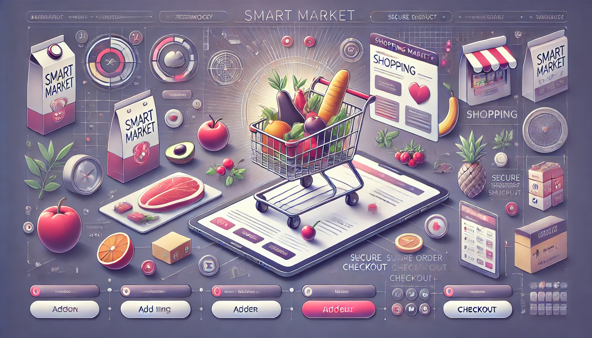

<div align="center">

# **🌟 SMART MARKET 🌟**

</div>




**Smart Market** is an user-friendly web application designed to bring the shopping experience right into your home! Built with Streamlit, it allows users to browse products, add items to a virtual shopping cart, and go through a smooth checkout process - all in a clean and intuitive interface.

---

## Features

• **Browse products:** View available products categorized into sections such as Fruit, Meat, Dairy, Snacks, etc.

• **Add to Basket:** Easily add items to your basket with quantity limits and live price updates.

• **Remove from basket:** Delete products or adjust their quantities.

• **Basket Summary:** View the contents of your basket along with a detailed cost breakdown (including tax).

• **Checkout:** Secure and easy checkout process.

---

## Project Structure

```
SMART_MARKET_PROJECT
├── images/                  # Folder containing images for the UI
│   ├── add_products.png
│   ├── checkout.png
│   ├── delete_products.png
│   ├── show_basket.png
│   ├── show_products.png
│   └── smart_market_png.webp
├── json_files/              # Folder containing JSON data files
│   ├── basket.json          # JSON file for tracking the basket
│   └── products.json        # JSON file containing product data
├── smart_market/            # Application's core package
│   ├── __init__.py          # Empty init file for the package
│   ├── add.py               # Handles adding products to the basket
│   ├── delete.py            # Handles removing products from the basket
│   ├── get_and_checks.py    # Utility functions for category/product validation
│   ├── lobby.py             # Renders the lobby/home page
│   └── show_and_checkout.py # Manages product display, basket view, and checkout
├── main.py                  # Main entry point of the application
└── README.md                # Project's documentation file

```

---

## Getting Started

### Prerequisites
1. ***Python 3.8 or later:*** Ensure Python is installed on your system.
2. ***Streamlit:*** Install Streamlit using the command:

```bash
pip install streamlit
```

### Installation

1. Clone this repository or download the files.
2. Navigate to the project directory:

```bash
cd your-project-folder
```
3. Install required Python packages:

```bash
pip install -r requirements.txt
```
   ***Note:*** If there’s no requirements.txt,
   ***manually install:*** **streamlit**
4. Running the Application
  **Option 1:**
  
```bash
streamlit run main.py
```
  ***Note:*** If that command doest work try the one below:
  **Option 2:**
  
```bash
python -m streamlit run main.py
```
  **Option 3:**
  Open your browser and navigate to the URL displayed in the terminal: 
  (usually http://localhost:8501).

---
### How It Works
1. **Start in the Lobby:** Begin in the main lobby and navigate through various features like adding or deleting products.
2. **Browse and Shop:**
  • Select products from categories.
  • Add them to your basket.
  • Remove or adjust quantities if needed.
3. **View Basket and Checkout:**
  • Review your basket contents.
  • See cost calculations with tax breakdown.
  • Complete the checkout process.

---

## JSON Data Format

### `products.json`

```json
{
  "Fruits and Vegetables": [
    {"name": "Apple", "price": 1.8},
    {"name": "Banana", "price": 1.6}
  ],
  "Meat": [
    {"name": "Chicken", "price": 9.5},
    {"name": "Beef", "price": 12}
  ]
}
```

### `basket.json`

```json
{
  "Apple": {
    "price": 1.8,
    "units": 2
  },
  "Orange": {
    "price": 1.7,
    "units": 4
  }
}
```

---

## Author

This project was developed by **Angel Jaen**,
a freshman Software Engineering major, as a first step into the world of technology and innovation. 
You can explore more of Angel’s projects [on GitHub](https://github.com/AnluYaens?tab=repositories).

For inquiries, feel free to contact me:
- **Email**: ajaen.solutions@gmail.com
- **Phone**: 151-....
- **Address**: In your heart ❤

---

## License

This project is proprietary and is not open source.
Unauthorized use, copying, modification, distribution, or any other action involving 
this software without prior written consent is strictly prohibited. If you wish to use or
contribute to this project, please contact the author for permission.

---

## Acknowledgments

Thank you for exploring the **Smart Market** application. We hope you have a seamless shopping experience!

